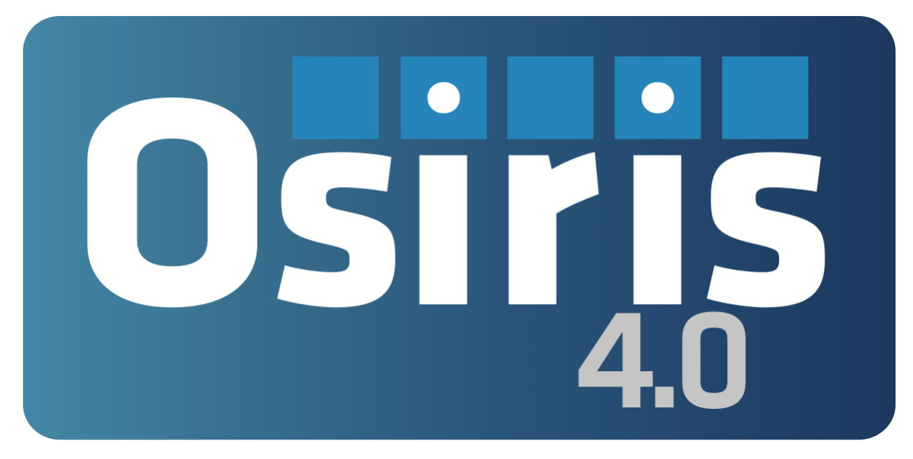

Neural network sampling of Bethe-Heitler process in particle-in-cell codes
=============================================================================================================================

<a href="https://arxiv.org/abs/2406.02491" style='vertical-align:middle; display:inline;'></a>
<a href="https://zenodo.org/records/11422851" style='vertical-align:middle; display:inline;'></a>
<a href="https://lbesson.mit-license.org/" style='vertical-align:middle; display:inline;'></a>        

<p align="center">
  </center>
</p>

This repository contains the Neural Networks developed in the paper by Ó. Amaro _et al._ ["Neural network sampling of Bethe-Heitler process in particle-in-cell codes"](https://arxiv.org/abs/2406.02491) (2024).

Pre-print: https://arxiv.org/abs/2406.02491

---

## Introduction

In this work we focus on Coulomb-QED processes like Bethe-Heitler (extension to Bremsstrahlung and Trident will be pursued in the future), which can be modelled in PIC codes using Monte-Carlo approaches. Here instead of pairing of particles and binary collisions, particles interact with their local environment (atomic fields in the case of Coulomb, or laser EM fields in the case of laser QED).
Cross-sections can be computationally demanding to compute in run-time. A common alternative is to use look-up-tables. Although fast, these can be innefficient for multiparameter functions, as they scale poorly in memory.
Neural Networks are a promising alternative to compress the same information into fewer parameters, leveraging on the simple nonlinear activation functions.

This work was based on the [comp_scatt_ML](https://github.com/chiarabadiali/comp_scatt_ML) project by [Chiara Badiali](https://github.com/chiarabadiali) and [Pablo Bilbao](https://github.com/pabilbado), where the pairing and scattering of binary collisions between macro-electrons and macro-photons is implemented with a Neural Network. See their publication in [JPP](https://www.cambridge.org/core/journals/journal-of-plasma-physics/article/abs/machinelearningbased-models-in-particleincell-codes-for-advanced-physics-extensions/9D34BB83508AF220EC60EF892079D053) and [pre-print](https://arxiv.org/abs/2206.02937).

## Directory Structure

- ```models``` - directory where trained models are stored
- ```scripts``` - example scripts on how to create datasets


## Installation

To use the notebooks, you must first clone the git repository.

```
git clone https://github.com/OsAmaro/osirisBetheHeitlerML.git
```

The training and model weights produced in our work are contained in this repository (ZIP ~760 MB, uncompressed ~3GB). Download training data [here](https://ulisboa-my.sharepoint.com/:u:/g/personal/ist187343_tecnico_ulisboa_pt/EUUUMmTPXfJHhmSAWUYMG94BCdCTJ8oUHm4dUvgOXwgfjw?e=GaM0Gd).

To avoid issues with previously installed Python packages, we recommend creating a new virtual environment.

### OSIRIS

The open-source version (currently without the ML modules) of the OSIRIS PIC code can be found [here](https://osiris-code.github.io/). To access the developer maintaned version with ML modules, see [here](https://epp.tecnico.ulisboa.pt/osiris/).


### Reproducing Paper Results

All figures in the manuscript should be reproducible following the instructions in the notebooks.


### Creating New Models

To train a new DNN model the following steps should be followed:

1. Generate a dataset of rates (TCS and iCDF)

2. Choose an architecture for the DNN and modify 

3. Convert the model to the format required by the fortran framework that you want to link to OSIRIS (FKB to produce a text file with the model weights).

4. Run PIC simulation and compare against theory or look-up-table implementations


---

### Acknowledgments

This article comprises part of the PhD thesis work of Óscar Amaro, which will be submitted to Instituto Superior Técnico, University of Lisbon.

The authors thank would like to acknowledge fruitful discussions with GoLP team members and for proofreading the manuscript, in particular Prof. Marija Vranic, Mr.[Diogo Carvalho](https://github.com/diogodcarvalho), Mr. Bernardo Barbosa, Mr. Pablo Bilbao, and Mr. Lucas Ansia.

### Citation

If you use the code, consider citing our [paper](https://arxiv.org/abs/2406.02491):

```
@misc{amaroNeuralNetworkSampling2024,
  title = {Neural Network Sampling of {{Bethe-Heitler}} Process in Particle-in-Cell Codes},
  author = {Amaro, {\'O}scar and Badiali, Chiara and Martinez, Bertrand},
  year = {2024},
  month = jun,
  number = {arXiv:2406.02491},
  eprint = {2406.02491},
  primaryclass = {physics},
  publisher = {arXiv},
  urldate = {2024-06-05},
  archiveprefix = {arXiv},
  copyright = {All rights reserved},
  keywords = {Physics - Computational Physics,Physics - Plasma Physics}
}
```

## Coulomb-QED processes

To learn more about Coulomb-QED processes and their implementation via look-up-tables

* [PoP paper](https://pubs.aip.org/aip/pop/article/26/10/103109/264054/High-energy-radiation-and-pair-production-by) "High-energy radiation and pair production by Coulomb processes in particle-in-cell simulations" by Bertrand Martinez et al
* [OSIRIS-QED](https://github.com/bertrandmartinez/benchmark_osiris_qed) extensive benchmark by Bertrand Martinez on Bethe-Heitler, Bremsstrahlung and Trident processes

## RePlasma
  
* [Badiali et al 2022 JPP](https://github.com/RePlasma/BadialiBilbao2022JPP) Machine-learning-based models in particle-in-cell codes for advanced physics extensions


## Related projects

* [comp_scatt_ML](https://github.com/chiarabadiali/comp_scatt_ML) by Chiara Badiali and Pablo Bilbao
* [dawson sheet model](https://github.com/diogodcarvalho/dawgnnson-sheet-model) by Diogo Carvalho
